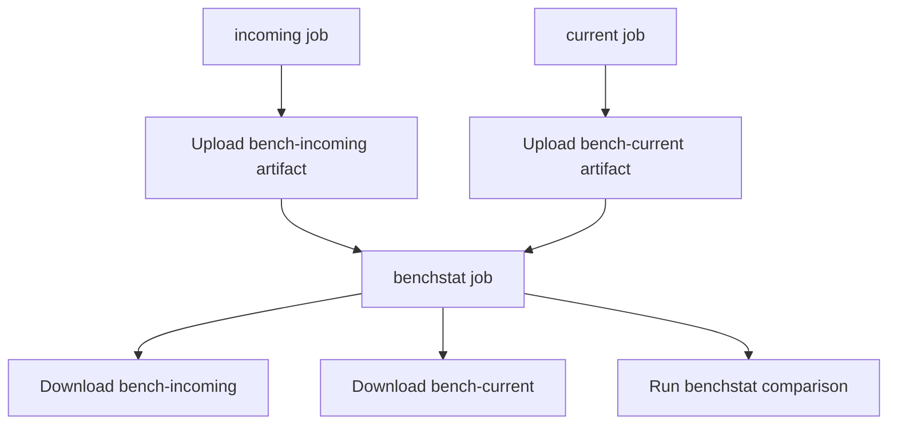
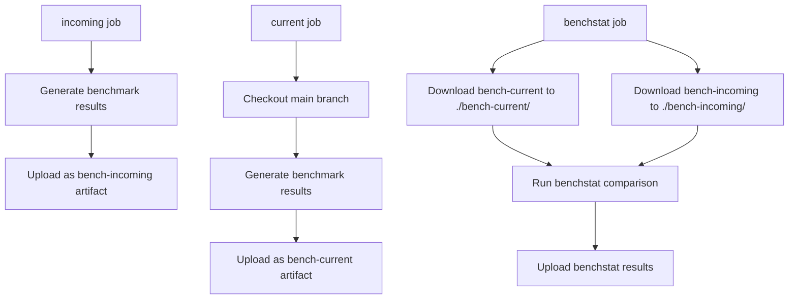

# Benchstat GitHub Action Workflow Fix Design

## Overview

The current benchstat GitHub Action workflow in `.github/workflows/benchstat.yml` is failing with the error:
```
benchstat: open bench-current/bench.txt: no such file or directory
```

This occurs because the workflow incorrectly assumes artifact download paths that don't match the actual GitHub Actions artifact download behavior. The workflow downloads artifacts named `bench-current` and `bench-incoming`, but then tries to access files at paths that don't exist.

## Current Workflow Analysis

### Existing Architecture


### Current Implementation Issues

1. **Artifact Path Mismatch**: The workflow assumes artifacts create directories `bench-current/` and `bench-incoming/` 
2. **Download Behavior**: `actions/download-artifact@v5` downloads artifacts to the current working directory by default, not to subdirectories named after the artifact
3. **File Reference Error**: `benchstat bench-current/bench.txt bench-incoming/bench.txt` expects nested directory structure that doesn't exist

### Artifact Download Behavior

When using `actions/download-artifact@v5`:
- **Without `path` parameter**: Downloads to current working directory
- **Multiple artifacts**: Each creates a subdirectory named after the artifact
- **Single artifact**: Files are placed directly in the specified or default directory

## Root Cause Analysis

### GitHub Actions Artifact Download Pattern
```
Current working directory structure after download:
├── bench-current/
│   └── bench.txt
├── bench-incoming/
│   └── bench.txt
└── (other workflow files)
```

### Expected vs Actual File Paths
- **Workflow expects**: `bench-current/bench.txt` and `bench-incoming/bench.txt`
- **Actual structure**: Artifacts are downloaded to subdirectories with artifact names
- **Problem**: The path references in benchstat command are correct, but artifact download might not be creating expected structure

## Solution Design

### Option 1: Explicit Path Configuration (Recommended)
Modify the download steps to explicitly specify paths that match the benchstat command expectations.

```yaml
- name: Download Current Benchmark
  uses: actions/download-artifact@v5
  with:
    name: bench-current
    path: bench-current

- name: Download Incoming Benchmark  
  uses: actions/download-artifact@v5
  with:
    name: bench-incoming
    path: bench-incoming
```

### Option 2: Adjust Command Paths
Keep default download behavior and adjust the benchstat command to match actual file locations.

```yaml
- name: Benchstat Results
  run: |
    ls -la  # Debug: show actual directory structure
    benchstat bench-current/bench.txt bench-incoming/bench.txt | tee -a benchstat.txt
```

### Option 3: File Reorganization
Download to default locations and reorganize files before running benchstat.

```yaml
- name: Download and Organize Files
  run: |
    mkdir -p bench-current bench-incoming
    mv bench-current/bench.txt bench-current/ || echo "File already in place"
    mv bench-incoming/bench.txt bench-incoming/ || echo "File already in place"
```

## Recommended Implementation

### Enhanced Workflow Structure


### Updated Workflow Configuration

```yaml
benchstat:
  needs: [incoming, current]
  runs-on: ubuntu-latest
  steps:
    - name: Install Go
      uses: actions/setup-go@v5
      with:
        go-version: stable
    - name: Install benchstat
      run: go install golang.org/x/perf/cmd/benchstat@latest
    - name: Download Current Benchmark
      uses: actions/download-artifact@v5
      with:
        name: bench-current
        path: bench-current
    - name: Download Incoming Benchmark
      uses: actions/download-artifact@v5
      with:
        name: bench-incoming
        path: bench-incoming
    - name: Debug Directory Structure
      run: |
        echo "=== Directory Structure ==="
        find . -name "*.txt" -type f
        echo "=== Current Directory Contents ==="
        ls -la bench-current/ bench-incoming/
    - name: Benchstat Results
      run: benchstat bench-current/bench.txt bench-incoming/bench.txt | tee -a benchstat.txt
    - name: Upload benchstat results
      uses: actions/upload-artifact@v4
      with:
        name: benchstat
        path: benchstat.txt
```

## Validation & Testing Strategy

### Debugging Steps
1. **Add directory listing commands** to verify actual file structure
2. **Check artifact download behavior** with explicit paths
3. **Validate file existence** before running benchstat
4. **Test with sample benchmark data** in development environment

### Pre-deployment Validation
```yaml
- name: Validate Files Exist
  run: |
    if [ ! -f "bench-current/bench.txt" ]; then
      echo "ERROR: bench-current/bench.txt not found"
      exit 1
    fi
    if [ ! -f "bench-incoming/bench.txt" ]; then
      echo "ERROR: bench-incoming/bench.txt not found" 
      exit 1
    fi
    echo "All benchmark files found successfully"
```

### Error Handling Enhancement
```yaml
- name: Benchstat Results
  run: |
    if benchstat bench-current/bench.txt bench-incoming/bench.txt > benchstat.txt; then
      echo "Benchstat comparison completed successfully"
      cat benchstat.txt
    else
      echo "Benchstat comparison failed"
      echo "Current directory structure:"
      find . -name "*.txt" -type f
      exit 1
    fi
```

## Alternative Solutions

### Benchmark Data Management
If the issue persists, consider alternative approaches:

1. **Combined Artifact Approach**: Upload both benchmark files in a single artifact with preserved directory structure
2. **Workflow Artifacts Pattern**: Use a consistent naming pattern for benchmark files
3. **External Storage**: Store benchmark results in external storage (S3, artifact registry) for better persistence

### Workflow Optimization Opportunities
1. **Caching**: Cache Go dependencies and benchstat binary
2. **Parallel Execution**: Run benchmarks in parallel where possible
3. **Results Archive**: Maintain historical benchmark results for trend analysis
4. **Notification Integration**: Add notifications for significant performance regressions

## Implementation Plan

### Phase 1: Immediate Fix
1. Update download steps with explicit `path` parameters
2. Add debugging output to verify file structure
3. Test workflow with minimal changes

### Phase 2: Enhancement
1. Add validation steps for file existence
2. Improve error handling and reporting
3. Add performance regression detection

### Phase 3: Optimization
1. Implement caching for dependencies
2. Add historical trend analysis
3. Integrate with PR comments for benchmark results