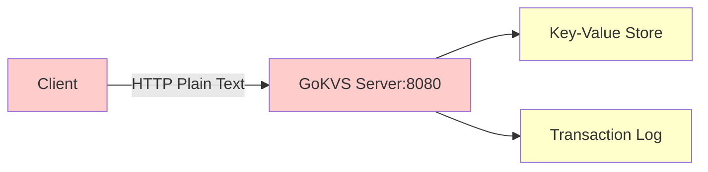
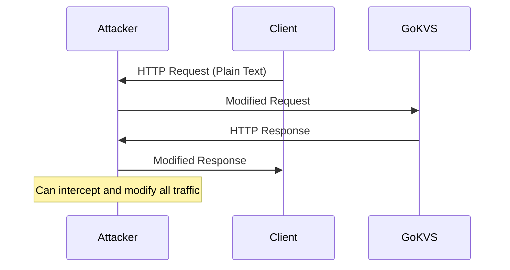
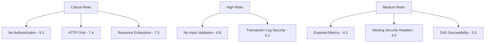
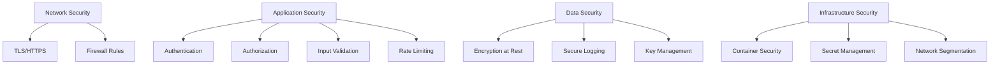

# Security Risk Assessment - GoKVS

## Overview

This document provides a comprehensive security risk assessment of the GoKVS (Go Key-Value Store) project, analyzing current security implementations, identifying vulnerabilities, and recommending security enhancements.

## Current Security Implementation

### Transport Security

#### HTTP Server Configuration
- **Current State**: HTTP-only server running on port 8080
- **TLS Configuration**: Commented out (`//TLSConfig: tlsConfig`)
- **Security Headers**: No security headers implemented
- **Risk Level**: HIGH



#### Server Timeouts
- **ReadTimeout**: 1 second
- **WriteTimeout**: 1 second  
- **IdleTimeout**: 30 seconds
- **ReadHeaderTimeout**: 2 seconds
- **Assessment**: Basic DoS protection through timeouts

### Authentication & Authorization

#### Current Implementation
- **Authentication**: None implemented
- **Authorization**: None implemented
- **API Access Control**: Open to all requests
- **Risk Level**: CRITICAL

#### Endpoint Access Matrix
| Endpoint | Method | Authentication | Authorization | Risk |
|----------|--------|---------------|---------------|------|
| `/v1/{key}` | GET | None | None | High |
| `/v1/{key}` | PUT | None | None | Critical |
| `/v1/{key}` | DELETE | None | None | Critical |
| `/metrics` | GET | None | None | Medium |
| `/healthz` | GET | None | None | Low |

### Input Validation & Sanitization

#### Key Validation
- **Length Limits**: No key length validation
- **Character Restrictions**: No character validation
- **Injection Protection**: Minimal protection via URL path parsing
- **Risk Level**: HIGH

#### Value Validation  
- **Size Limits**: No value size validation
- **Content Filtering**: No content validation
- **Memory Protection**: Unbounded value storage
- **Risk Level**: HIGH

```go
// Current implementation lacks validation
func keyValuePutHandler(w http.ResponseWriter, r *http.Request) {
    vars := mux.Vars(r)
    key := vars["key"] // No validation
    
    value, err := io.ReadAll(r.Body) // No size limit
    // No sanitization or validation
}
```

### Data Storage Security

#### In-Memory Store
- **Encryption**: No encryption at rest
- **Access Control**: Concurrent access via RWMutex
- **Memory Protection**: Basic synchronization only
- **Risk Level**: MEDIUM

#### Transaction Log
- **File Security**: No file permissions enforcement
- **Encryption**: No encryption of transaction log
- **Integrity**: No integrity verification
- **Backup Security**: No secure backup mechanism
- **Risk Level**: HIGH

## Identified Security Vulnerabilities

### Critical Vulnerabilities

#### 1. No Authentication/Authorization
- **CVSS Score**: 9.1 (Critical)
- **Impact**: Complete unauthorized access to data
- **Exploit**: Any user can read, modify, or delete any data
- **Recommendation**: Implement API key or JWT-based authentication

#### 2. Unencrypted HTTP Traffic
- **CVSS Score**: 7.4 (High)  
- **Impact**: Data transmitted in plain text
- **Exploit**: Network sniffing, man-in-the-middle attacks
- **Recommendation**: Implement TLS/HTTPS

#### 3. Unbounded Resource Consumption
- **CVSS Score**: 7.5 (High)
- **Impact**: Memory exhaustion, denial of service
- **Exploit**: Large value uploads, unlimited key storage
- **Recommendation**: Implement size limits and rate limiting

### High Risk Vulnerabilities

#### 4. No Input Validation
- **CVSS Score**: 6.8 (Medium)
- **Impact**: Potential injection attacks, data corruption
- **Exploit**: Malformed keys/values, special characters
- **Recommendation**: Implement comprehensive input validation

#### 5. Exposed Metrics Endpoint
- **CVSS Score**: 4.3 (Medium)
- **Impact**: Information disclosure
- **Exploit**: `/metrics` endpoint reveals internal statistics
- **Recommendation**: Secure metrics endpoint

#### 6. Transaction Log Vulnerabilities
- **CVSS Score**: 6.2 (Medium)
- **Impact**: Data integrity, unauthorized access to log files
- **Exploit**: File system access, log tampering
- **Recommendation**: Implement log encryption and integrity checks

### Medium Risk Vulnerabilities

#### 7. Missing Security Headers
- **CVSS Score**: 4.0 (Medium)
- **Impact**: Client-side attacks, information disclosure
- **Exploit**: Missing CORS, CSP, security headers
- **Recommendation**: Implement security headers

#### 8. DoS Attack Susceptibility  
- **CVSS Score**: 5.3 (Medium)
- **Impact**: Service availability
- **Exploit**: Slowloris attack (demonstrated in examples/)
- **Recommendation**: Implement connection limits and rate limiting

## Attack Vectors & Threat Modeling

### Network-Based Attacks

#### Man-in-the-Middle (MITM)


#### Denial of Service (DoS)
- **Slowloris Attack**: Demonstrated in `examples/slowloris/main.go`
- **Resource Exhaustion**: Unlimited data storage
- **Connection Flooding**: No connection limits

### Application-Level Attacks

#### Data Manipulation
- **Unauthorized Read**: No access control on GET operations
- **Unauthorized Write**: No access control on PUT operations  
- **Unauthorized Delete**: No access control on DELETE operations

#### Information Disclosure
- **Metrics Exposure**: Internal statistics accessible
- **Error Messages**: Potential information leakage
- **Transaction Log**: Unencrypted persistent data

## Security Controls Assessment

### Existing Controls

| Control Type | Implementation | Effectiveness | Status |
|-------------|---------------|---------------|---------|
| Network Timeouts | HTTP server timeouts | Limited | Implemented |
| Concurrent Access | RWMutex synchronization | Good | Implemented |
| Error Handling | Basic error responses | Limited | Implemented |
| Graceful Shutdown | Signal handling | Good | Implemented |
| Static Binary | Minimal attack surface | Good | Implemented |

### Missing Critical Controls

| Control Type | Current State | Risk Level | Priority |
|-------------|---------------|------------|----------|
| TLS/HTTPS | Not implemented | Critical | High |
| Authentication | Not implemented | Critical | High |
| Authorization | Not implemented | Critical | High |
| Input Validation | Not implemented | High | High |
| Rate Limiting | Not implemented | High | Medium |
| Security Headers | Not implemented | Medium | Medium |
| Encryption at Rest | Not implemented | High | Medium |

## Security Testing Analysis

### Current Testing Coverage

#### Security Testing Tools
- **gosec**: Static security analysis implemented
- **govulncheck**: Vulnerability checking implemented  
- **Fuzzing**: Basic fuzzing tests implemented
- **Mutation Testing**: Code mutation testing available

#### Test Coverage Gaps
- **Authentication Testing**: No authentication tests
- **Authorization Testing**: No authorization tests
- **TLS Testing**: No encryption tests
- **Rate Limiting Tests**: No rate limiting tests
- **Input Validation Tests**: Minimal validation tests

### Recommended Security Tests

```go
// Example security test structure
func TestSecurityValidation(t *testing.T) {
    tests := []struct {
        name string
        key string
        value string
        expectedStatus int
    }{
        {"oversized_key", strings.Repeat("a", 1024), "value", http.StatusBadRequest},
        {"oversized_value", "key", strings.Repeat("b", 10*1024*1024), http.StatusBadRequest},
        {"malicious_key", "../../../etc/passwd", "value", http.StatusBadRequest},
        {"sql_injection", "'; DROP TABLE users; --", "value", http.StatusBadRequest},
    }
    // Test implementation...
}
```

## Compliance & Standards

### Security Standards Assessment

#### OWASP Top 10 Compliance
| Risk | Current Status | Mitigation |
|------|---------------|------------|
| A01 - Broken Access Control | Non-compliant | Implement authentication/authorization |
| A02 - Cryptographic Failures | Non-compliant | Implement TLS and encryption |
| A03 - Injection | Partially compliant | Enhanced input validation |
| A04 - Insecure Design | Partially compliant | Security architecture review |
| A05 - Security Misconfiguration | Non-compliant | Security headers and configuration |

## Risk Matrix



## Recommended Security Enhancements

### Immediate Priority (Critical)

#### 1. Implement HTTPS/TLS
```go
// Recommended TLS configuration
tlsConfig := &tls.Config{
    MinVersion: tls.VersionTLS12,
    CipherSuites: []uint16{
        tls.TLS_ECDHE_RSA_WITH_AES_256_GCM_SHA384,
        tls.TLS_ECDHE_RSA_WITH_CHACHA20_POLY1305,
    },
}
srv.TLSConfig = tlsConfig
```

#### 2. Add Authentication Middleware
```go
func authMiddleware(next http.Handler) http.Handler {
    return http.HandlerFunc(func(w http.ResponseWriter, r *http.Request) {
        apiKey := r.Header.Get("X-API-Key")
        if !validateAPIKey(apiKey) {
            http.Error(w, "Unauthorized", http.StatusUnauthorized)
            return
        }
        next.ServeHTTP(w, r)
    })
}
```

#### 3. Input Validation
```go
func validateInput(key, value string) error {
    if len(key) > 256 {
        return errors.New("key too long")
    }
    if len(value) > 1024*1024 { // 1MB limit
        return errors.New("value too large")
    }
    if !regexp.MustCompile(`^[a-zA-Z0-9_-]+$`).MatchString(key) {
        return errors.New("invalid key format")
    }
    return nil
}
```

### High Priority

#### 4. Rate Limiting
```go
func rateLimitMiddleware(next http.Handler) http.Handler {
    limiter := rate.NewLimiter(rate.Limit(10), 100) // 10 req/sec, burst 100
    return http.HandlerFunc(func(w http.ResponseWriter, r *http.Request) {
        if !limiter.Allow() {
            http.Error(w, "Rate limit exceeded", http.StatusTooManyRequests)
            return
        }
        next.ServeHTTP(w, r)
    })
}
```

#### 5. Security Headers
```go
func securityHeadersMiddleware(next http.Handler) http.Handler {
    return http.HandlerFunc(func(w http.ResponseWriter, r *http.Request) {
        w.Header().Set("X-Content-Type-Options", "nosniff")
        w.Header().Set("X-Frame-Options", "DENY") 
        w.Header().Set("X-XSS-Protection", "1; mode=block")
        w.Header().Set("Strict-Transport-Security", "max-age=31536000")
        next.ServeHTTP(w, r)
    })
}
```

### Medium Priority

#### 6. Transaction Log Encryption
- Implement AES-256 encryption for transaction logs
- Add integrity verification (HMAC)
- Secure key management

#### 7. Metrics Security
- Implement authentication for `/metrics` endpoint
- Limit exposed metrics information
- Add access logging

## Security Architecture Recommendations

### Defense in Depth Strategy



### Security Monitoring

#### Logging Enhancements
- Security event logging
- Access attempt monitoring
- Rate limiting violations
- Authentication failures

#### Metrics for Security
- Failed authentication attempts
- Rate limit violations  
- Unusual access patterns
- Error rate monitoring

## Conclusion

The GoKVS project currently has significant security vulnerabilities that need immediate attention. The absence of authentication, authorization, and transport encryption poses critical risks for any production deployment. While the project includes some security testing tools and demonstrates good practices in certain areas (like graceful shutdown and static binary compilation), fundamental security controls are missing.

**Priority Actions:**
1. Implement HTTPS/TLS immediately
2. Add authentication and authorization mechanisms
3. Implement comprehensive input validation and rate limiting
4. Enhance security testing coverage
5. Add security monitoring and logging

**Risk Assessment**: The current security posture is inadequate for production use and requires substantial security enhancements before deployment in any environment handling sensitive data.