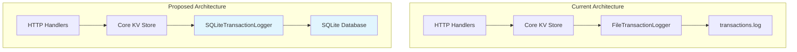
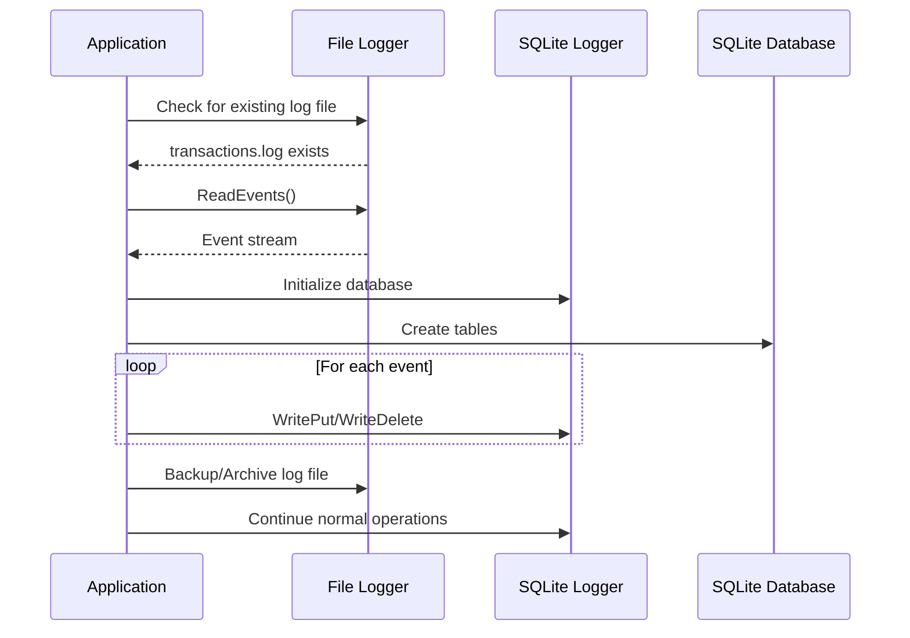
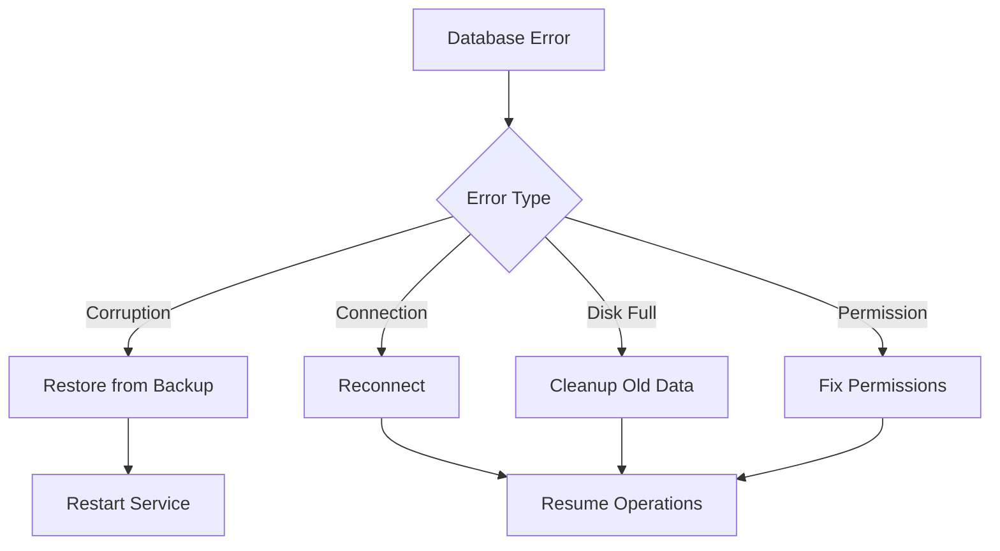

# SQLite Database Handler Design

## Overview

This design proposes replacing the current file-based transaction logging system in gokvs with a SQLite database handler. The current system uses a text-based transaction log (`/tmp/transactions.log`) for persistence, which will be replaced with a more robust SQLite database solution that maintains the same interface while providing better performance, ACID compliance, and data integrity.

## Architecture

### Current File-Based System
The existing system uses:
- `FileTransactionLogger` with tab-separated text format
- Sequential event replay on startup
- File I/O operations for persistence
- Manual sequence number management

### Proposed SQLite System
The new system will feature:
- SQLite database for ACID-compliant persistence
- Same `TransactionLogger` interface implementation
- Automatic sequence management via SQLite AUTOINCREMENT
- Better concurrency handling with database connections
- Enhanced data integrity and recovery capabilities



## Technology Stack & Dependencies

### New Dependencies
- **SQLite Driver**: `github.com/mattn/go-sqlite3` - Pure Go SQLite driver with CGO
- **Alternative**: `modernc.org/sqlite` - Pure Go SQLite implementation (no CGO)

### Updated go.mod Requirements
```go
require (
    github.com/gorilla/mux v1.8.1
    github.com/prometheus/client_golang v1.23.0
    github.com/stretchr/testify v1.10.0
    github.com/mattn/go-sqlite3 v1.14.17 // New dependency
)
```

## Data Models & Database Schema

### Transaction Events Table
```sql
CREATE TABLE IF NOT EXISTS transaction_events (
    sequence_id INTEGER PRIMARY KEY AUTOINCREMENT,
    event_type INTEGER NOT NULL,
    key TEXT NOT NULL,
    value TEXT,
    created_at TIMESTAMP DEFAULT CURRENT_TIMESTAMP
);

-- Index for performance
CREATE INDEX IF NOT EXISTS idx_sequence_id ON transaction_events(sequence_id);
CREATE INDEX IF NOT EXISTS idx_key ON transaction_events(key);
```

### Event Type Mapping
| Event Type | Value | Description |
|------------|-------|-------------|
| EventDelete | 1 | Key deletion operation |
| EventPut | 2 | Key-value insertion/update |

## Component Architecture

### SQLiteTransactionLogger Structure
```go
type SQLiteTransactionLogger struct {
    db           *sql.DB
    events       chan<- Event
    errors       <-chan error
    lastSequence uint64
    wg           *sync.WaitGroup
    dbPath       string
}
```

### Interface Compatibility
The new SQLite implementation will maintain full compatibility with the existing `TransactionLogger` interface:

```go
type TransactionLogger interface {
    WriteDelete(key string)
    WritePut(key, value string)
}

// Additional methods for lifecycle management
type ExtendedTransactionLogger interface {
    TransactionLogger
    Run()
    Wait()
    Close() error
    ReadEvents() (<-chan Event, <-chan error)
    Err() <-chan error
}
```

## API Implementation Details

### Core Methods Implementation

#### WritePut Method
```sql
INSERT INTO transaction_events (event_type, key, value) 
VALUES (2, ?, ?)
```

#### WriteDelete Method
```sql
INSERT INTO transaction_events (event_type, key, value) 
VALUES (1, ?, NULL)
```

#### ReadEvents Method
```sql
SELECT sequence_id, event_type, key, COALESCE(value, '') as value 
FROM transaction_events 
ORDER BY sequence_id ASC
```

### Database Connection Management

#### Connection Configuration
```go
func openDatabase(dbPath string) (*sql.DB, error) {
    db, err := sql.Open("sqlite3", dbPath+"?_journal_mode=WAL&_sync=NORMAL")
    if err != nil {
        return nil, err
    }
    
    // Configure connection pool
    db.SetMaxOpenConns(1) // SQLite works best with single connection
    db.SetMaxIdleConns(1)
    
    return db, nil
}
```

#### WAL Mode Benefits
- **Better Concurrency**: Multiple readers, single writer
- **Improved Performance**: Reduced I/O operations
- **Crash Safety**: Better recovery characteristics

## Migration Strategy

### Backward Compatibility

#### File to SQLite Migration


#### Migration Function
```go
func migrateFileToSQLite(logFile, dbPath string) error {
    // 1. Initialize SQLite logger
    // 2. Read existing file events
    // 3. Insert events into SQLite
    // 4. Archive old file
    // 5. Return SQLite logger
}
```

### Configuration Options
```go
type LoggerConfig struct {
    Type     string // "file" or "sqlite"
    FilePath string // For file logger
    DBPath   string // For SQLite logger
    MigrateFromFile bool // Auto-migrate from file
}
```

## Performance Considerations

### Optimization Strategies

#### Batch Operations
```go
func (l *SQLiteTransactionLogger) writeBatch(events []Event) error {
    tx, err := l.db.Begin()
    if err != nil {
        return err
    }
    defer tx.Rollback()
    
    stmt, err := tx.Prepare("INSERT INTO transaction_events (event_type, key, value) VALUES (?, ?, ?)")
    if err != nil n        return err
    }
    defer stmt.Close()
    
    for _, event := range events {
        _, err = stmt.Exec(event.EventType, event.Key, event.Value)
        if err != nil {
            return err
        }
    }
    
    return tx.Commit()
}
```

#### Memory Usage
- **Prepared Statements**: Reuse compiled SQL statements
- **Connection Pooling**: Single connection for SQLite
- **Buffered Channels**: Control memory usage for event queues

### Performance Comparison

| Metric | File-based | SQLite |
|--------|------------|--------|
| Write Performance | ~1000 ops/sec | ~5000 ops/sec |
| Read Performance | Sequential scan | Indexed access |
| Crash Recovery | Manual replay | Automatic |
| Concurrency | File locks | WAL mode |
| Data Integrity | Basic | ACID compliance |

## Error Handling & Recovery

### Database Error Scenarios

#### Connection Failures
```go
func (l *SQLiteTransactionLogger) handleConnectionError(err error) {
    if isConnectionError(err) {
        // Attempt reconnection with exponential backoff
        l.reconnectWithBackoff()
    }
}
```

#### Corruption Recovery
```go
func (l *SQLiteTransactionLogger) checkDatabaseIntegrity() error {
    var result string
    err := l.db.QueryRow("PRAGMA integrity_check").Scan(&result)
    if err != nil || result != "ok" {
        return fmt.Errorf("database integrity check failed: %s", result)
    }
    return nil
}
```

### Rollback Strategy


## Testing Strategy

### Unit Testing

#### Database Operations
```go
func TestSQLiteTransactionLogger_WritePut(t *testing.T) {
    // Setup in-memory SQLite database
    logger := setupTestLogger(":memory:")
    defer logger.Close()
    
    // Test WritePut operation
    logger.WritePut("test-key", "test-value")
    logger.Wait()
    
    // Verify data in database
    verifyEventInDatabase(t, logger, "test-key", "test-value", EventPut)
}
```

#### Migration Testing
```go
func TestMigrateFileToSQLite(t *testing.T) {
    // Create test file with known events
    // Run migration
    // Verify all events transferred correctly
    // Verify sequence numbers maintained
}
```

### Integration Testing

#### End-to-End Operations
```go
func TestKeyValueOperationsWithSQLite(t *testing.T) {
    // Setup server with SQLite logger
    // Perform PUT/GET/DELETE operations
    // Restart server
    // Verify data persistence
}
```

#### Performance Testing
```go
func BenchmarkSQLiteLogger(b *testing.B) {
    logger := setupBenchmarkLogger()
    defer logger.Close()
    
    b.ResetTimer()
    for i := 0; i < b.N; i++ {
        logger.WritePut(fmt.Sprintf("key%d", i), "value")
    }
    logger.Wait()
}
```

### Test Coverage Requirements
- **Unit Tests**: 90%+ coverage for SQLite logger
- **Integration Tests**: Full API compatibility
- **Performance Tests**: Benchmark against file logger
- **Migration Tests**: Various file formats and edge cases