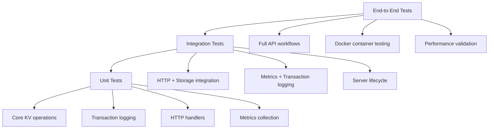
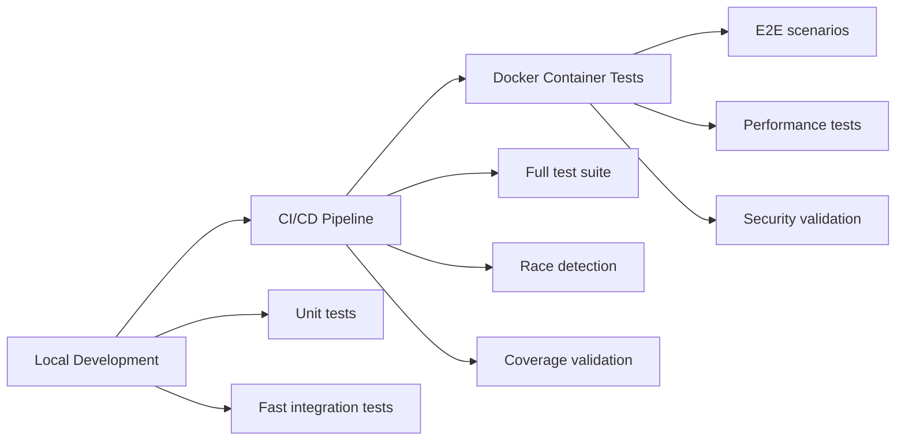
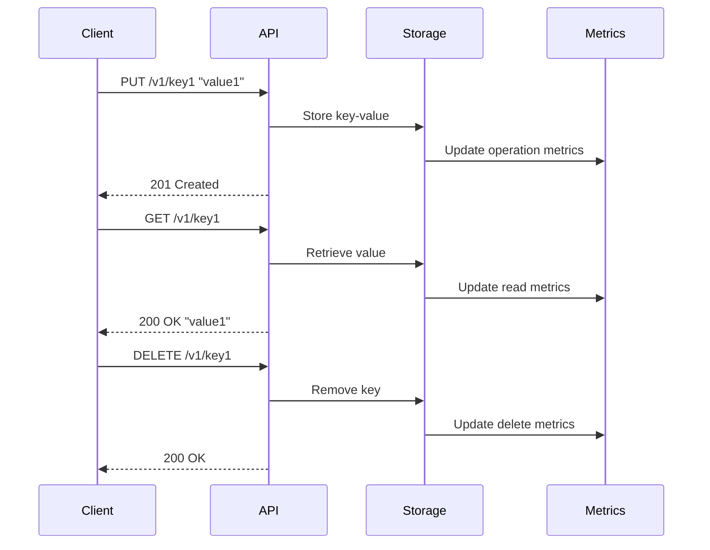
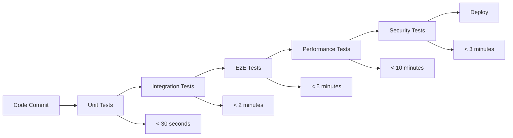

# Test Coverage Enhancement Design

## Overview

This design outlines a comprehensive testing strategy to improve unit tests, integration tests, and end-to-end tests for the gokvs key-value store application. The current testing infrastructure provides basic coverage but lacks comprehensive test scenarios, proper test isolation, and systematic testing of error conditions and edge cases.

The enhancement will establish a robust testing pyramid with:
- **Unit Tests**: Individual component testing with comprehensive coverage
- **Integration Tests**: Component interaction testing
- **End-to-End Tests**: Full system behavior validation

## Current Testing State Analysis

### Existing Test Coverage
```
Current test files:
├── cmd/server/server_test.go        # Basic HTTP handler tests
├── cmd/server/setup_teardown_test.go # Test infrastructure 
├── internal/core_test.go           # Core KV operations + benchmarks
├── internal/metrics_test.go        # Prometheus metrics tests
└── internal/transact_test.go       # Transaction logging tests
```

### Current Testing Tools
- **Standard Go testing**: `go test`
- **Race detection**: `go test -race`  
- **Coverage reporting**: `go test -coverprofile=coverage.out`
- **Benchmarking**: `go test -bench`
- **Fuzzing**: `go test -fuzz`
- **Mutation testing**: go-mutesting, gremlins
- **Security testing**: gosec, govulncheck

### Identified Gaps
1. **Limited edge case coverage** for error scenarios
2. **Insufficient integration testing** between components
3. **No comprehensive end-to-end testing** of full workflows
4. **Missing performance regression tests**
5. **Inadequate concurrency testing**
6. **No containerized testing environment**
7. **Missing API contract testing**

## Architecture

### Test Pyramid Structure



### Testing Environment Strategy



## Unit Tests Enhancement

### Core Module Testing (`internal/core_test.go`)

#### Enhanced Test Scenarios
```
TestKVOperations:
├── Basic operations (existing)
├── Concurrent access patterns
├── Memory pressure scenarios  
├── Large key/value handling
├── UTF-8 and special character support
├── Error condition handling
└── Thread safety validation
```

#### New Test Functions
- `TestConcurrentOperations`: Validate thread safety under concurrent load
- `TestLargeDataHandling`: Test behavior with large keys/values
- `TestSpecialCharacters`: UTF-8 and special character support
- `TestMemoryPressure`: Behavior under memory constraints
- `TestErrorConditions`: Comprehensive error scenario coverage

### Transaction Logger Testing (`internal/transact_test.go`)

#### Enhanced Coverage Areas
```
TestTransactionLogger:
├── File I/O error handling
├── Concurrent read/write scenarios
├── Log file corruption recovery
├── Performance under load
├── Disk space exhaustion
└── Log replay validation
```

#### New Test Functions  
- `TestFileIOErrors`: Simulate disk errors and recovery
- `TestConcurrentLogging`: Multiple goroutines writing simultaneously
- `TestLogCorruption`: Handle corrupted transaction logs
- `TestDiskSpaceExhaustion`: Behavior when disk is full
- `TestLogRotation`: Future log rotation functionality

### HTTP Handler Testing (`cmd/server/server_test.go`)

#### Enhanced Test Coverage
```
TestHTTPHandlers:
├── Request validation and sanitization
├── Content-Type handling
├── Error response formatting
├── Concurrent request handling
├── Request timeout scenarios
└── Malformed request handling
```

#### New Test Functions
- `TestRequestValidation`: Input sanitization and validation
- `TestConcurrentRequests`: Multiple simultaneous requests
- `TestRequestTimeouts`: Long-running request scenarios
- `TestMalformedRequests`: Invalid HTTP requests handling
- `TestContentTypeHandling`: Various content types

### Metrics Testing (`internal/metrics_test.go`)

#### Enhanced Metrics Validation
```
TestMetrics:
├── Counter accuracy under load
├── Histogram bucket validation
├── Metric label consistency
├── Prometheus exposition format
└── Memory usage of metrics
```

#### New Test Functions
- `TestMetricAccuracy`: Validate counter/histogram accuracy
- `TestMetricMemoryUsage`: Memory footprint of metrics
- `TestPrometheusFormat`: Correct exposition format
- `TestMetricConcurrency`: Thread-safe metric collection

## Integration Tests

### Component Integration Testing

#### HTTP + Storage Integration
```
TestHTTPStorageIntegration:
├── PUT → GET → DELETE workflows
├── Transaction logging during HTTP operations  
├── Recovery after server restart
├── Concurrent HTTP operations with persistence
└── Error propagation between layers
```

#### Metrics + Operations Integration  
```
TestMetricsIntegration:
├── Metric updates during operations
├── Error metrics on failures
├── Performance metric accuracy
├── Metric persistence across restarts
└── Prometheus scraping simulation
```

### New Integration Test Files

#### `test/integration/api_storage_test.go`
Tests the interaction between HTTP API and storage layers:
- Request processing with transaction logging
- Error handling across component boundaries
- State consistency during failures
- Recovery scenarios

#### `test/integration/metrics_workflow_test.go`  
Tests metrics collection during real workflows:
- Metric accuracy during operations
- Error metric generation
- Performance metric collection
- Prometheus compatibility

#### `test/integration/server_lifecycle_test.go`
Tests server startup, operation, and shutdown:
- Transaction log replay on startup
- Graceful shutdown behavior
- Signal handling
- Resource cleanup

### Test Infrastructure Components

#### Test Helpers (`test/helpers/`)
```
test/helpers/
├── server.go           # Test server setup/teardown
├── storage.go          # Test storage utilities
├── requests.go         # HTTP request helpers
└── assertions.go       # Custom test assertions
```

#### Test Data Management (`test/testdata/`)
```
test/testdata/
├── transaction_logs/   # Sample transaction logs
├── corrupt_data/       # Corrupted data scenarios
├── large_datasets/     # Performance test data
└── edge_cases/         # Edge case test data
```

## End-to-End Tests

### Full Workflow Testing

#### API Workflow Tests


#### Container-based E2E Tests
```
TestDockerWorkflows:
├── Container startup and readiness
├── API accessibility from external clients
├── Data persistence across container restarts
├── Resource usage monitoring
└── Graceful shutdown behavior
```

### New E2E Test Files

#### `test/e2e/api_workflows_test.go`
Complete API workflow testing:
- Full CRUD operations
- Error scenarios
- Performance validation
- Data consistency

#### `test/e2e/docker_integration_test.go`
Docker container testing:
- Container lifecycle management
- External connectivity
- Volume persistence
- Resource constraints

#### `test/e2e/performance_test.go`
Performance validation:
- Throughput testing
- Latency measurement
- Resource usage monitoring
- Load testing scenarios

### Performance Testing Strategy

#### Load Testing Scenarios
```
Performance Test Matrix:
├── Single client scenarios
│   ├── Sequential operations
│   ├── Rapid fire requests
│   └── Large payload handling
├── Multi-client scenarios  
│   ├── Concurrent reads
│   ├── Concurrent writes
│   ├── Mixed workloads
│   └── Connection pooling
└── Stress testing
    ├── Memory pressure
    ├── CPU intensive operations
    ├── Disk I/O limits
    └── Network constraints
```

#### Benchmark Enhancements
- `BenchmarkConcurrentOperations`: Multi-goroutine performance
- `BenchmarkLargePayloads`: Large data handling performance  
- `BenchmarkHighFrequency`: Rapid operation performance
- `BenchmarkMemoryEfficiency`: Memory usage optimization

## Testing Infrastructure

### Test Environment Setup

#### Local Development Environment
```bash
# Setup test environment
make test-setup

# Run test suites
make test-unit          # Unit tests only
make test-integration   # Integration tests  
make test-e2e          # End-to-end tests
make test-all          # Complete test suite

# Performance testing
make test-performance   # Performance/load tests
make test-benchmark     # Benchmark comparisons
```

#### CI/CD Integration
```yaml
# .github/workflows/test.yml enhancement
Test Matrix:
├── Go versions: [1.22, 1.23, latest]
├── OS platforms: [ubuntu, macos, windows]  
├── Test types: [unit, integration, e2e]
├── Coverage validation: minimum 85%
└── Performance regression detection
```

### Test Data Management

#### Test Database/Storage
- Isolated test storage instances
- Predictable test data sets
- Cleanup and reset mechanisms
- Transaction log test scenarios

#### Mock and Stub Framework
```
test/mocks/
├── storage_mock.go     # Storage layer mocking
├── http_mock.go        # HTTP client mocking  
├── metrics_mock.go     # Metrics collection mocking
└── time_mock.go        # Time-based operation mocking
```

### Continuous Testing Strategy

#### Test Automation Pipeline


#### Quality Gates
- **Unit test coverage**: Minimum 90%
- **Integration test coverage**: All component interactions
- **E2E test coverage**: All user workflows
- **Performance benchmarks**: No regression > 10%
- **Security validation**: All critical paths tested

### Test Reporting and Monitoring

#### Coverage reporting
- Line coverage analysis
- Branch coverage validation  
- Function coverage tracking
- Integration point coverage

#### Performance Monitoring
- Benchmark trend analysis
- Performance regression detection
- Resource usage tracking
- Load test result comparison

#### Test Result Dashboard
- Test execution status
- Coverage metrics visualization
- Performance trend charts
- Failure analysis reports

### Implementation Roadmap

#### Phase 1: Unit Test Enhancement (Week 1-2)
1. Enhance existing unit tests with edge cases
2. Add comprehensive error scenario testing
3. Implement concurrent operation testing
4. Add performance benchmarks

#### Phase 2: Integration Test Development (Week 3-4)
1. Create integration test infrastructure
2. Develop component interaction tests
3. Implement server lifecycle testing
4. Add metrics integration validation

#### Phase 3: E2E Test Implementation (Week 5-6)
1. Develop API workflow testing
2. Create Docker integration tests
3. Implement performance validation
4. Add load testing scenarios

#### Phase 4: CI/CD Integration (Week 7-8)
1. Enhance CI/CD pipeline
2. Implement test automation
3. Add performance monitoring
4. Create test reporting dashboard