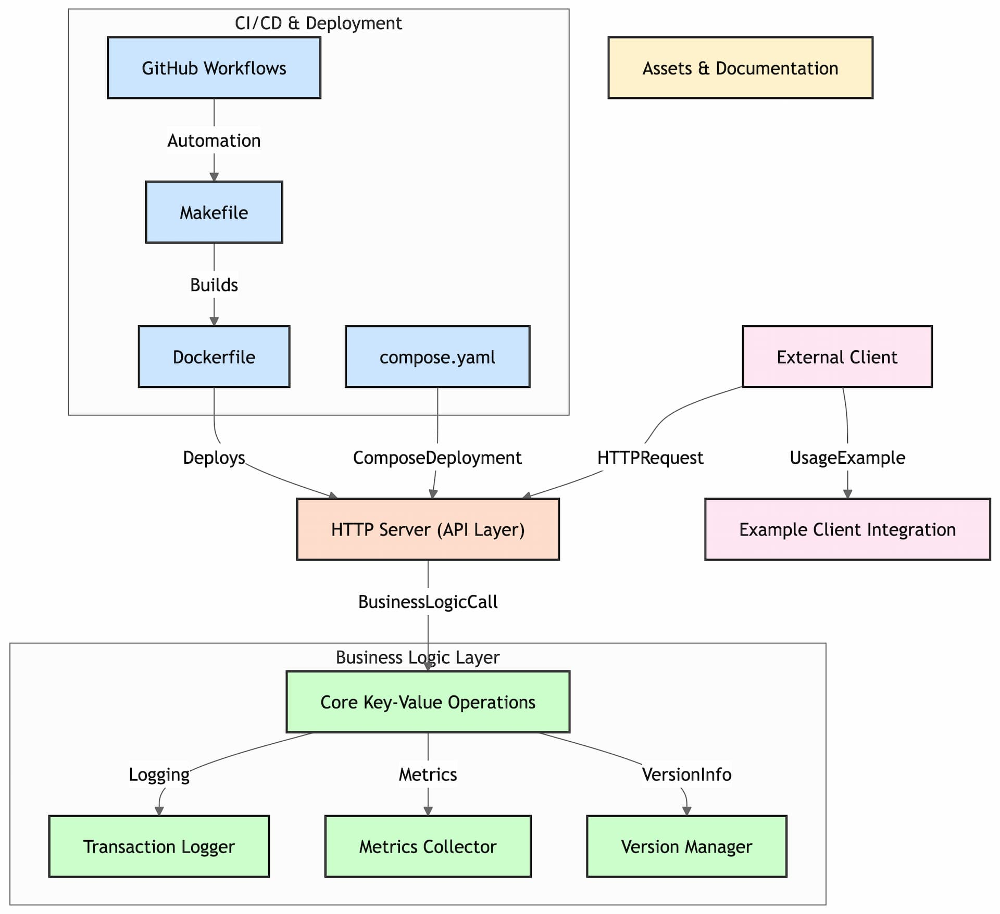

# Go Key-Value Store

<p align="left">

</p>

[](https://pkg.go.dev/github.com/davidaparicio/gokvs)
[](https://goreportcard.com/report/davidaparicio/gokvs)
[](https://github.com/davidaparicio/gokvs/blob/main/LICENSE.md)
[](https://app.fossa.com/projects/git%2Bgithub.com%2Fdavidaparicio%2Fgokvs?ref=badge_shield)
[]()
[](https://twitter.com/intent/follow?screen_name=dadideo)

## Table of Contents

- [Introduction](#introduction)
- [Usage](#usage)
- [Contribute](#contribute)
- [Limitations](#limitations)
- [Improvement list](#improvement-list)
- [License](#license)
- [Contact](#contact)

<!--[comment1]: <> (- [Features](#features))
[comment2]: <> (- [Getting Started](#getting-started)- [Prerequisites](#prerequisites)- [Installation](#installation))-->

## Introduction

A simple KV from the O'Reilly, Cloud Native Go book (Matthew A. Titmus)

## Usage

```bash
make help
```

To have all make commands

```bash
benchmark                      Run benchmark tests 🚄
check-editorconfig             Use to check if the codebase follows editorconfig rules
check-format                   Used by CI to check if code is formatted
clean                          Clean your artifacts 🧼
compile                        Compile for the local architecture ⚙
doc                            Launch the offline Go documentation 📚
docker                         Docker run 🛠
dockerbuild                    Docker build 🛠
dockerfull                     Docker build and run 🛠
format                         Format the code using gofmt
fuzz                           Run fuzzing tests 🌀
goreleaser                     Run goreleaser directly at the pinned version 🛠
help                           Show help messages for make targets
install                        Install the program to /usr/bin 🎉
lint                           Runs the linter
mod                            Go mod things
run                            Run the server
sec                            Go Security checks code for security issues 🔒
test                           🤓 Run go tests
```

As an example: 

```bash
❯ make dockerfull
docker build -t gokvs .
[+] Building 5.5s (16/16) FINISHED
[...]
docker run -it --rm -p 8008:8080 gokvs
Server: 	GoKVs - Community
Version: 	v0.0.1-SNAPSHOT
Git commit: 	54a8d74ea3cf6fdcadfac10ee4a4f2553d4562f6q
Built: 		Thu Jan  1 01:00:00 CET 1970

2024/10/26 20:14:31 0 events replayed
2024/10/26 20:14:31 Server running on port 8080
^C2024/10/26 20:14:36
2024/10/26 20:14:36 Caught the following signal: interrupt
2024/10/26 20:14:36 Gracefully shutting down server..
2024/10/26 20:14:36 Server stopping...
2024/10/26 20:14:36 Server stopped
2024/10/26 20:14:36 Gracefully shutting down TransactionLogger...
2024/10/26 20:14:36 FileTransactionLogger closed
```

### gRPC API

The store is also exposed over gRPC (`cmd/grpc`), defined in
[`api/kvs/v1/kvs.proto`](api/kvs/v1/kvs.proto): unary `Get`/`Set`/`Delete`
plus a server-streaming `Watch(key)` that pushes change notifications
(an empty key watches every key). The server chains a **logging interceptor**
and a **token-auth interceptor** (reads `authorization: Bearer <token>`
metadata), supports **TLS** with self-signed certificates, and serves a
**REST layer via grpc-gateway** mirroring the proto's `google.api.http`
annotations (an OpenAPI description is generated at
[`api/kvs/v1/kvs.swagger.json`](api/kvs/v1/kvs.swagger.json)).

```bash
# Plaintext, no auth: gRPC on :50051, REST gateway on :8081
make grpc-run

# TLS (self-signed, generated by scripts/gen-certs.sh) + token auth
make certs
go run ./cmd/grpc -tls-cert certs/server.crt -tls-key certs/server.key -auth-token secret

# Bundled CLI client
go run ./cmd/grpcclient -token secret -ca-cert certs/server.crt set hello world
go run ./cmd/grpcclient -token secret -ca-cert certs/server.crt get hello
go run ./cmd/grpcclient -token secret -ca-cert certs/server.crt watch hello  # streams changes
go run ./cmd/grpcclient -token secret -ca-cert certs/server.crt del hello

# Same operations through the REST gateway
curl -H "Authorization: Bearer secret" -X PUT localhost:8081/v1/kv/hello -d '{"value":"world"}'
curl -H "Authorization: Bearer secret" localhost:8081/v1/kv/hello
curl -N -H "Authorization: Bearer secret" localhost:8081/v1/watch/hello  # streams JSON events
curl -H "Authorization: Bearer secret" -X DELETE localhost:8081/v1/kv/hello
```

Regenerate the protobuf/gateway code with `make proto` (requires
[buf](https://buf.build) and the `protoc-gen-go`, `protoc-gen-go-grpc`,
`protoc-gen-grpc-gateway`, `protoc-gen-openapiv2` plugins in your `PATH`).

### Diagram



### Building and running your application

When you're ready, start your application by running:
`docker compose up --build`.

Your application will be available at http://localhost:8080.

### Deploying your application to the cloud

First, build your image, e.g.: `docker build -t myapp .`.
If your cloud uses a different CPU architecture than your development
machine (e.g., you are on a Mac M1 and your cloud provider is amd64),
you'll want to build the image for that platform, e.g.:
`docker build --platform=linux/amd64 -t myapp .`.

Then, push it to your registry, e.g. `docker push myregistry.com/myapp`.

Consult Docker's [getting started](https://docs.docker.com/go/get-started-sharing/)
docs for more detail on building and pushing.

## Contribute

Works on my machine - and yours ! Spin up pre-configured, standardized dev environments of this repository, by clicking on the button below.

[](https://gitpod.io/#/https://github.com/davidaparicio/gokvs)

## Limitations
* Like in the book, currently: Key/Value only text, without spaces

## Tests
* Mutation testing with [avito-tech/go-mutesting](https://github.com/avito-tech/go-mutesting) and [gremlins](https://github.com/go-gremlins/gremlins)

## Improvement list
* UTF-8/space/all chars acceptation as key or value
* Implement Continuous Profiling/Go telemetry with [Otel](https://opentelemetry.io/docs/languages/go/getting-started/) with [global registry](https://austince.github.io/blog/using-otel-with-prometheus-global-registry/) or [Pyroscope](https://pyroscope.io/)?
* Use [Jaeger](https://www.jaegertracing.io/), [Coroot](https://coroot.com/docs/coroot-community-edition) for telemetry
* Use [jub0bs/fcors](https://github.com/jub0bs/fcors) for security improvment
* Use [Qovery](https://www.qovery.com/blog/qovery-x-gitpod-partnership) / [DevoxxFR2023 workshop](https://gitlab.com/devoxxfr-2023/env-tests/realworld-devoxxfr) to improve the DevX?
* Enforce tests with [go-fault](https://github.com/lingrino/go-fault): Fault injection library in Go using standard http middleware

### References
* [Docker's Go guide](https://docs.docker.com/language/golang/)

## License
Licensed under the MIT License, Version 2.0 (the "License"). You may not use this file except in compliance with the License.
You may obtain a copy of the License [here](https://choosealicense.com/licenses/mit/).

If needed some help, there are a ["Licenses 101" by FOSSA](https://fossa.com/blog/open-source-licenses-101-mit-license/), a [Snyk explanation](https://snyk.io/learn/what-is-mit-license/)
of MIT license and a [French conference talk](https://www.youtube.com/watch?v=8WwTe0vLhgc) by [Jean-Michael Legait](https://twitter.com/jmlegait) about licenses.

[Open source management report powered by FOSSA](https://app.fossa.com/reports/03c2cde1-b0ab-40c5-a115-aef795e0646c)

## Contact

If you have any questions or suggestions regarding the project, feel free to reach out to our team in the [GitHub issues](https://github.com/davidaparicio/gokvs/issues).